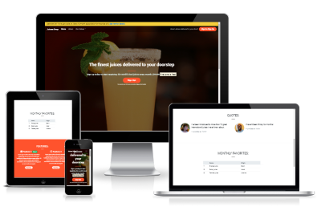

# Juices Drop

'Juices Drop' responsive landing page is a mini-project built using the Frontend Development tutorials provided as part of the Code Institute curriculum.
'Juices Drop' is the landing page for an imaginary juice delivery service.

 
 

## Features

- Bootstrap is used for making the basic structure of the page
- Contains four main sections
- Contains dropdown menus
- Responsive design

 The page has a modern design and can be used as a template for other landing pages. When creating the basic design of the page, the Bootstrap framework was used. The CSS code was then refined to create a unique design.

 ## Sections of the page

 - **The  Callout section**
 - **The  Quotes section**
 - **The  Monthly Favorites section**
 - **The  Features section**

  

 

 The page looks nice on the different screen sizes.

  
 

 
## Technologies Used

### Languages Used
- HTML
- CSS
- Bootstrap framework

### Sites & Programs Used

- Bootstrap:
Bootstrap framework was used for making the basic structure of the page.

- VSCode:
VSCode was used for editing the code, commiting and pushing it to GitHub.

- Git:
Git was used for version control by utilizing the Gitpod terminal to commit to Git and Push to GitHub.

- GitHub:
GitHub is used to store the projects code after being pushed from Git.

- Paint:
Paint was used to create images for README.md.

- The site https://ui.dev/amiresponsive
The site allowed to get a nice picture demonstrating how The Sea Battle game will look on different devices.

- Google Translate:
https://translate.google.com/

## Deployment

The site has been deployed to Pages on GitHub. For that I chose my project depository, went to Settings section, on the left bar chose Pages, in the Source section chose the option Branch: main, confirmed it with clicking the button Save and on the blue field the URL appeared where my project was deployed.

The URL on GitHub with my project is https://github.com/Juniva616/my-boots

The live link to my project is https://juniva616.github.io/my-boots/

## Credits

### Code
The code was taken from the Frontend Development tutorials provided as part of the Code Institute curriculum with the minor adjustmens of the design.

### Images
Free images were taken from pexels.com